# Pulled, sold back, repackaged: three crypto card gacha sites, June to September 2026

Public research by @shady_oak1. Original thread: https://x.com/shady_oak1/status/2106006294721429869. Data windows and method in section 6; the dataset is in section 5.

**Contents:** [Summary](#summary) · [1. Sold back to the house](#1-how-often-a-pull-is-sold-back-to-the-house-and-how-fast) · [2. Recycling](#2-recycling-the-same-card-sold-again) · [3. Pricing](#3-pricing-versus-the-market) · [4. Receipts](#4-on-chain-receipts) · [5. Data](#5-data) · [6. Method](#6-method-and-limits) · [7. Disclosure](#7-disclosure-and-attribution)

## Summary

Courtyard, Collector Crypt and Phygitals sell randomized packs of graded trading cards with an instant cash buyback. This report uses public live pull feeds the sites publish, CardLadder values and sales, and public blockchain records.

**Key findings**

| $500+ pulls | Courtyard | Collector Crypt | Phygitals |
|:---|:---|:---|:---|
| Sold back to the house | 80.8% | 95.9% | 93.1% |
| Median time from pull to sell-back, seconds | 50 | 9 | 20 |
| Same slab pulled again by Sep 30 | 77.8% | 95.8% | 92.9% |
| Pulls per slab, average | 4.2 | 15.0 | 11.4 |
| Priced above CardLadder | 61.1% | 66.2% | 55.8% |

*Sold back, on-chain: Courtyard, first exit of all 28,009 pulls to its buyback wallet, Jun 24 to Sep 23; Collector Crypt, a 1,000-pull sample (±3.1 pts), and Phygitals, all 6,927 pulls, Jun 24 to Sep 15. Pulled again: pulls Jun 24 to Sep 15. Pulls per slab and priced above CardLadder: Jun 24 to Sep 30.*

## 1. How often a pull is sold back to the house, and how fast

**Most high-value pulls go straight back to the operator, usually within a minute.**

> **Definition.** "Sold back to the house" means the operator paid the puller USDC for the card and the card's token went back to the operator's wallet in the same transaction, or, for Collector Crypt sell-backs before delivery (below), never left it.

**Courtyard (Polygon)**

- **Coverage:** we read the token transfers of all 28,009 Courtyard pulls priced $500+ from Jun 24 to Sep 23, as of Oct 1.
- **First exit:** a sale to Courtyard's buyback wallet for 80.8%, a transfer to Courtyard's redemption wallet for 14.3%, and 5.0% were still held.
- **Speed:** sell-backs came a median 50 seconds after the pull (p25 23 s, p75 4.3 min). 54.0% came within 1 minute, 86.8% within 1 hour and 94.0% within 24 hours.
- **Timing precision:** times are interpolated from block numbers, ±2 s.
- **Payouts:** the 22,626 sell-backs paid $24.8M in USDC, gross.
- **Check:** 400 of 400 random cases matched Courtyard's own transaction history.

**Collector Crypt and Phygitals (Solana)**

- **Coverage:** for pulls from Jun 24 to Sep 15, we read on Oct 8 the outcome of every $500+ Phygitals pull and of random samples of the other three tiers (method in section 6).
- **Sell-backs before delivery:** on 384 of 1,000 sampled $500+ Collector Crypt pulls (38%), the card never left the vault: the puller paid for the pack and the payout wallet paid them back at the published rate seconds later (median 2 s, timed from the pack payment).

**All sites, by price tier**

| Site and price tier | Pulls read | Sold back to the house | Median time to sell-back (p75) | Within 1 min / 1 h / 24 h | Median payout, % of pull price |
|---|---|---|---|---|---|
| Courtyard, $500+ | all 28,009 | 80.8% (first exit) | 50 s (4.3 min) | 54.0% / 86.8% / 94.0% | 84.6% |
| Collector Crypt, $500+ | 1,000 of 68,891 | 95.9% ±3.1 | 9 s (23 s) | 89.3% / 98.8% / 100.0% | 93.0% |
| Collector Crypt, $300 to $499 | 400 of 17,368 | 94.5% ±4.8 | 18 s (36 s) | 81.7% / 95.8% / 98.4% | 90.0% |
| Phygitals, $500+ | all 6,927 | 93.1% | 20 s (51 s) | 76.9% / 95.7% / 98.9% | 90.0% |
| Phygitals, $100 to $499 | 400 of 27,758 | 95.5% ±4.9 | 17 s (31 s) | 86.9% / 97.9% / 99.2% | 90.0% |

> **Margins.** 95% intervals, in percentage points. The Phygitals $500+ row covers every pull, so no margin applies. Timing shares are of the pulls that were sold back.

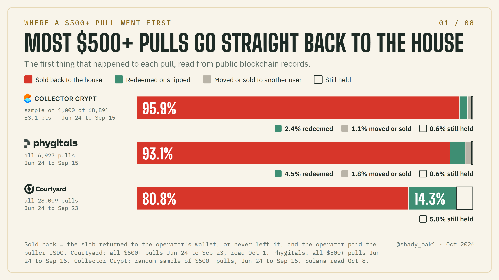

*Chart 1. First exit of $500+ pulls: all Courtyard pulls Jun 24 to Sep 23; all Phygitals pulls and a sample of 1,000 Collector Crypt pulls (±3.1 pts), Jun 24 to Sep 15.*

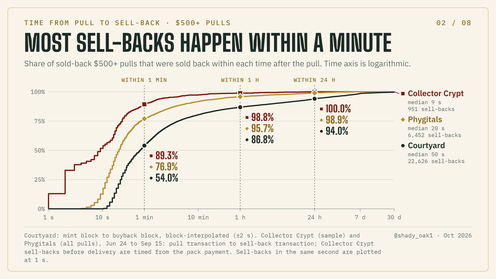

*Chart 2. Time from pull to sell-back for the $500+ pulls that were sold back, on a log time scale. Collector Crypt sell-backs before delivery are timed from the pack payment.*

**Published rates.** The cash paid back matched a fixed share of the site's own pull price.

- **Collector Crypt: 93%** on its $1,000 Grail pack, the most common rate on $500+ pulls.
- **Phygitals: 85, 90, 92 or 100% by pack.** 90% was the most common on $500+ pulls, as the site showed its rates on Jul 8. The Black and Diamond packs were at 100% as of Oct 3.
- **Courtyard: 84.6%**, the rate paid on-chain on 81% of $500+ sell-backs.
- **Paid exactly the pack's published rate:** all sampled Collector Crypt sell-backs. On Phygitals, 96.5% of $500+ sell-backs, and 99.8% from Jul 1 on (some late-June packs paid 85%, then 90%).

**Courtyard snapshot, all price tiers**

> **Snapshot.** A rolling 6-hour window of Courtyard's public pull feed, 07:52:12 to 13:52:20 UTC on Oct 8, 2026.

- **Counted:** the 4,748 pulls at least 2 hours old (created 07:52:12 to 11:52:18 UTC).
- **Outcome:** 79.0% had been sold back and 1.6% redeemed.

| Pull price | Pulls | Sold back | Redeemed |
|---|---|---|---|
| $0 to $25 | 2,578 | 81.4% | 0.8% |
| $25 to $100 | 1,862 | 76.8% | 2.3% |
| $100 to $500 | 252 | 72.6% | 4.8% |
| $500+ | 56 | 73.2% | 1.8% |

## 2. Recycling: the same card, sold again

**A card that is sold back is repackaged and sold again, many times.**

- **Matching:** by the slab's grading cert number.
- **Sold back first:** in the Collector Crypt and Phygitals on-chain samples, 99.4% of pulls whose slab was pulled again later had first been sold back to the house.

| $500+ pulls, Jun 24 to Sep 15 | Collector Crypt | Phygitals | Courtyard |
|---|---|---|---|
| Pulls | 68,891 | 6,927 | 26,210 |
| Same slab pulled again by Sep 30 | 95.8% | 92.9% | 77.8% |

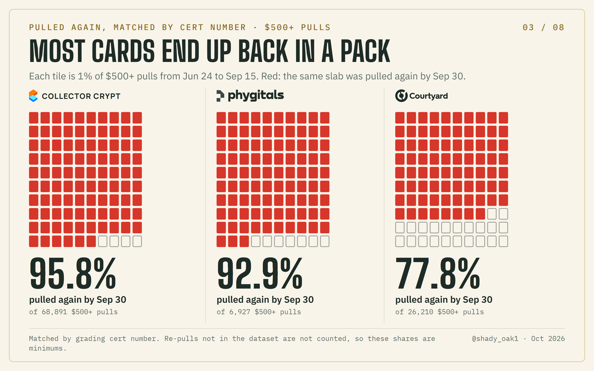

*Chart 3. Share of $500+ pulls (Jun 24 to Sep 15) whose slab, by cert number, was pulled again by Sep 30.*

**Pulls per slab, Jun 24 to Sep 30**

| | Collector Crypt | Phygitals | Courtyard |
|---|---|---|---|
| Average pulls per $500+ slab | 15.0 | 11.4 | 4.2 |
| Median gap between two pulls of the same slab | 20.4 h | 13 h | 30 h |
| Most-pulled slab | Aquapolis Tyranitar PSA 8 (105 pulls by 66 accounts) | Chinese 1st Edition Raichu PSA 8 (160 pulls) | Potion Energy PSA 9 (56 pulls) |

> **Caveat.** Re-pulls not in the dataset are not counted, so these are minimums.

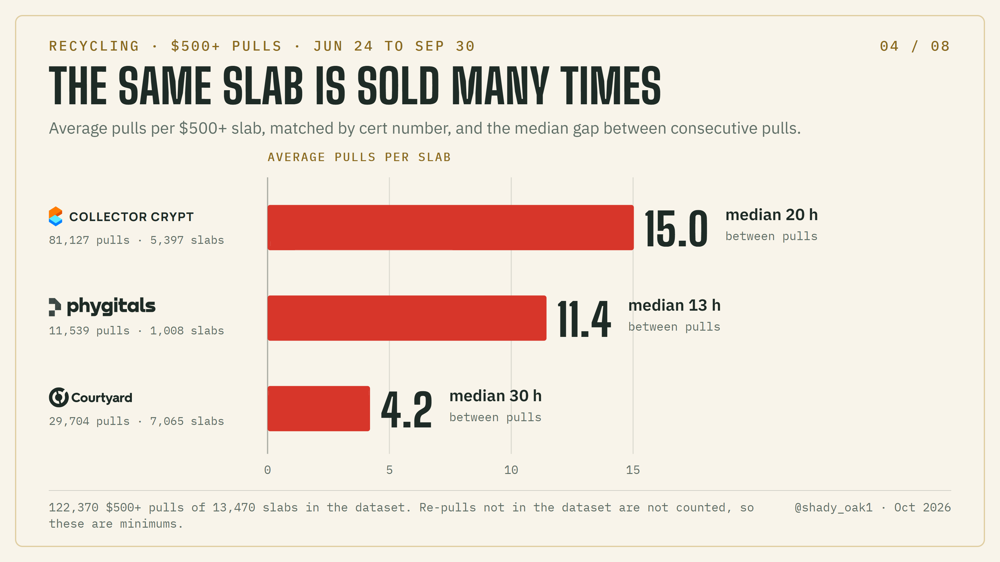

*Chart 4. Average pulls per $500+ slab in the dataset and the median gap between pulls of the same slab, Jun 24 to Sep 30.*

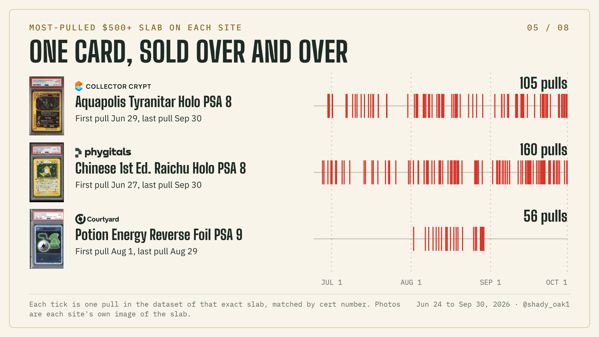

*Chart 5. Every pull in the dataset of the most-pulled $500+ slab on each site, Jun 24 to Sep 30.*

**Compared with a local card shop.** The comparison can be checked against the data.

- **In a shop:** a buy-back and a resale are two separate transactions on a physical card that changes hands.
- **In this data:** over three months, a $500+ slab was pulled 15.0 times on Collector Crypt, 11.4 times on Phygitals and 4.2 times on Courtyard, with a median gap of 20, 13 and 30 hours between pulls.
- **Back to the house:** the typical pull went back in 50 seconds on Courtyard, 9 seconds on Collector Crypt and 20 seconds on Phygitals.
- **Redemption or shipping:** few $500+ pulls went there first (first exits, as in Chart 1): 14.3% on Courtyard, 2.4% in the Collector Crypt sample and 4.5% on Phygitals.

## 3. Pricing versus the market

**The price printed on a pull sits above independent values more often than below, and the instant buyback paid a fixed share of that price.**

| $500+ pulls, Jun 24 to Sep 30 | Collector Crypt | Phygitals | Courtyard |
|---|---|---|---|
| Priced above CardLadder's value for that cert | 66.2% | 55.8% | 61.1% |
| Priced above CardLadder and above every sale of that slab in the 30 days before the pull | 22.6% (18,270) | 29.2% (3,353) | 13.8% (4,079) |

*Base: 122,219 pulls; for the second row, the 121,953 with at least one sale recorded before the pull (pull counts in parentheses).*

> **Caveat.** The Phygitals 29.2% is inflated by thin sales. Its slabs had a median of 3 sales in those 30 days, against 12 on Collector Crypt and 9 on Courtyard, and 40% of its cases rested on a single last sale. Counting only pulls with at least one sale that month, the shares are 22.6%, 22.1% and 12.8%.

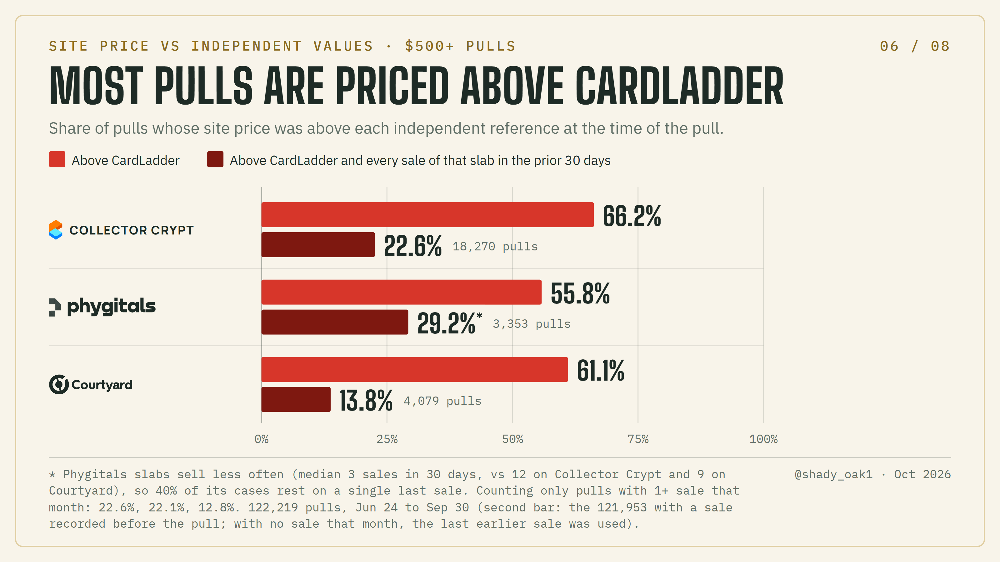

*Chart 6. Share of $500+ pulls priced above CardLadder, and above CardLadder and every sale in the prior 30 days, Jun 24 to Sep 30.*

**Forward test.** A forward test avoids any lag in CardLadder. For pulls from Jun 24 to Sep 23, it compares the site price with the median sale of the same cert in the next 7 days.

| Site price above that median sale | Collector Crypt | Phygitals | Courtyard |
|---|---|---|---|
| Share of pulls | 75.5% | 55.1% | 66.9% |
| With 3+ sales that week | 81.1% | 57.0% | 68.0% |

On those 3+ sale cases:

| | Collector Crypt | Phygitals | Courtyard |
|---|---|---|---|
| Average miss, site price | 16.4% | 12.2% | 9.2% |
| Average miss, CardLadder | 8.1% | 11.2% | 9.9% |
| Average miss, median of last 5 sales | 6.7% | 9.3% | 7.7% |
| Typical signed miss, site price | +9.1% | +2.1% | +3.7% |
| Typical signed miss, CardLadder | +0.7% | 0.0% | +0.7% |

Courtyard came out best of the three: its average miss was slightly smaller than CardLadder's, though it still leaned high.

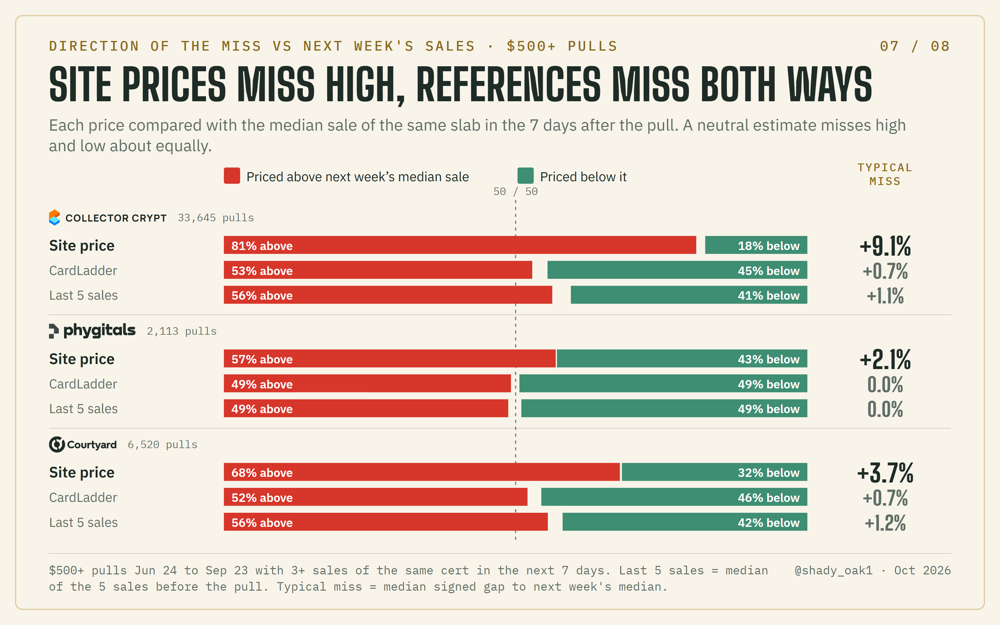

*Chart 7. Share of $500+ pulls priced above or below the next week's median sale, slabs with 3+ sales that week, Jun 24 to Sep 23.*

**Market drift.** Prices of these slabs fell over the quarter. For the same $500+ slab, median sale Jul 1 to 14 against Sep 10 to 23 (3+ sales in each):

| | Typical change | Slabs | Share that went up |
|---|---|---|---|
| Collector Crypt | -10.5% | 658 | 23.1% |
| Phygitals | -6.2% | 52 | 42.3% |
| Courtyard | -5.2% | 103 | 40.8% |

**Phygitals pricing, checked Oct 3 to 6, 2026**

- **Source of the price:** the price on a Phygitals pull matched the value its card page shows as "FMV by ALT".
- **Not refreshed while the house held the card, in our checks:** 96% of 298 house-held cards still carried their last pull value, and 98% of re-pulls since September showed the identical value.
- **Distance from ALT's live value:** pull values sat a median 14% away, in both directions.
- **Round-number chase values:** some chase cards carry round-number values far above their own page's price history. The 1st Edition Gyarados PSA 10 page shows $56,000 next to its own price history of $25,214.

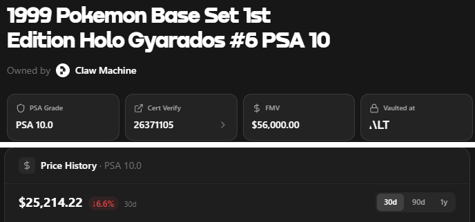

*Phygitals card page, Oct 3, 2026: title and value tiles (top) and the price history panel from the same page (bottom).*

The buybacks in section 1 paid a share of this site price, not of an independent value.

## 4. On-chain receipts

**A sell-back is visible on public blockchains as a transfer to the house wallet plus a USDC payment to the puller, and payouts can land far from independent values in both directions.**

**(a) Phygitals: Dark Slowbro CGC 10, Black Pack ("100%" buyback)**

- **Bought back:** $1,551.71 on Sep 15 and again on Sep 17.
- **ALT's price history those days:** $3,174.78 and $3,161.05.
- **CardLadder:** $3,120.
- **Transactions:** [Sep 15](https://solscan.io/tx/2R9Y97pEk5gQhBcnQ7nJPWFVUchK9SyPfa3Rb5hpkzCJsQ3k9DvnGkGowGEnxtSeJknEtsN6vzkqk4sbd7WaTnJV), [Sep 17](https://solscan.io/tx/2wQLAaMHaTRhXoSQp24SSVaXj81UA3VS79sWLsVUEStqkxEvA158CWgCHgz1R2JpJFp1Mn1CKGV4XBLruy5zzK7m).

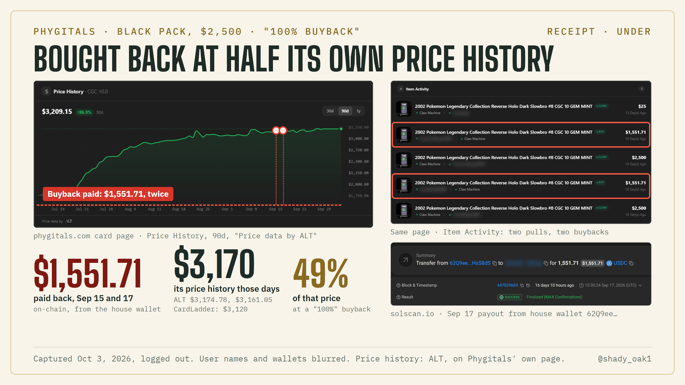

*Receipt (a). Phygitals card page and Solscan, captured Oct 3, 2026; user names and wallets blurred.*

**(b) Phygitals: Caterpie PSA 10, Black and Diamond Packs**

- **Bought back:** $5,492.20, twice on Sep 16.
- **ALT that day:** $3,260.10.
- **CardLadder:** $4,131.
- **Transactions:** [Black Pack](https://solscan.io/tx/34zMvDc21s7Zq5izsCoRp8NqMwdfnLChHrB4vECGJdA4vhmYgqQdsX2jgJDGgwyKSjWKtQ83Htd2iFvf3NY5HsWF), [Diamond Pack](https://solscan.io/tx/5CerCmcRCNvwSydh7PZ3AAkQiVtxwoDXqAnxo6NEy2yZB92mPYN1J9h7q8FWEnbh4qZZ4GBykeFRD4Q8E3STx3T1).

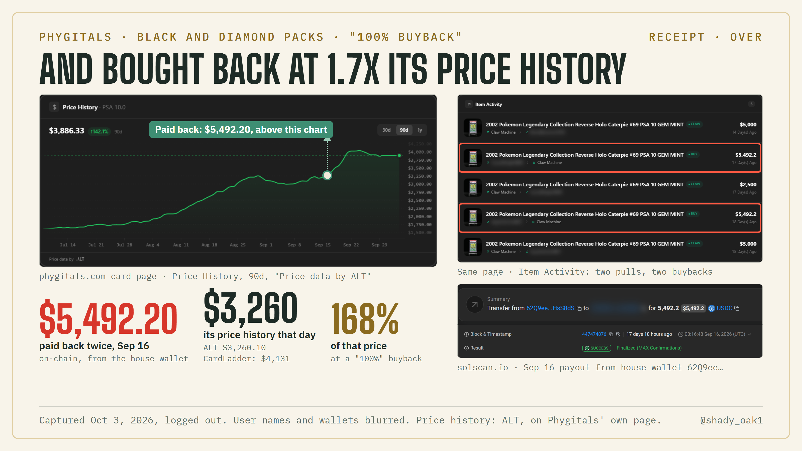

*Receipt (b). Phygitals card page and Solscan, captured Oct 3, 2026; user names and wallets blurred.*

**Both ways.** 641 recent Black and Diamond Pack "100%" buybacks (the latest 5 activity entries per card, read Oct 3, 2026):

- **Far from value:** 43 paid under 90% of both ALT that day and CardLadder, and 36 paid over 110% of both. Only cards where the two references agree within 25% are counted.
- **Speed:** the median sell-back came 15 seconds after the pull (588 with timing).
- **Payout:** it equaled the pull value recorded at pull time within 0.5% in 548 of 588.

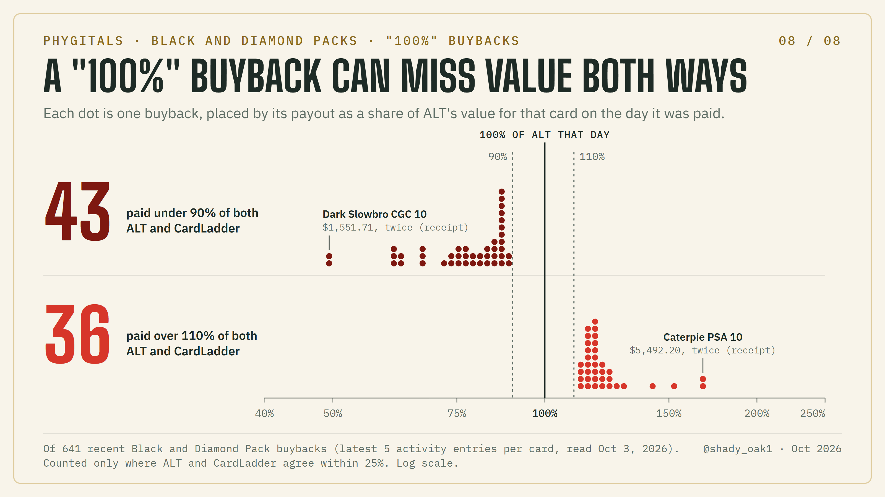

*Chart 8. Phygitals "100%" buybacks paid under 90% or over 110% of both ALT and CardLadder, of 641 recent Black and Diamond Pack buybacks.*

**(c) Collector Crypt: 2011 Pokémon Call of Legends Entei Holo #SL3, PSA 8, $1,000 Grail pack**

- **Pulled:** from the vault HiGHqwYddP5N2waqUmXPdaASpMpUEvfqPr2fSawctEb on Jun 30, 2026 at 07:15:38 UTC.
- **Sold back:** 17 seconds later, at 07:15:55 UTC. The slab returned to that vault.
- **Payout:** the payout wallet GachaNgyXTU3zFogQ8Z5jR2BLXs8215X2AtEH18VxJq3 paid 674.25 USDC in the same transaction: 93% of the $725.00 pull price, the published rate.
- **Transactions:** [pull](https://solscan.io/tx/4AnCNsaRgkqZZi1R8H16HcEWpQ9RF22tLnCdhJiNJaLmoNdRmjskNDYS4FVNwLXM9mGZZShUReBGyPM7yQZMX8iC), [sell-back](https://solscan.io/tx/2ow5NrkvFMD661n5i9twvPMEWr8Z8jmdWFDAeqNgwPAtofrr6B77rVrcTUgFmA2hL6XGeVGbNrmv1tUtBUgSttAm).

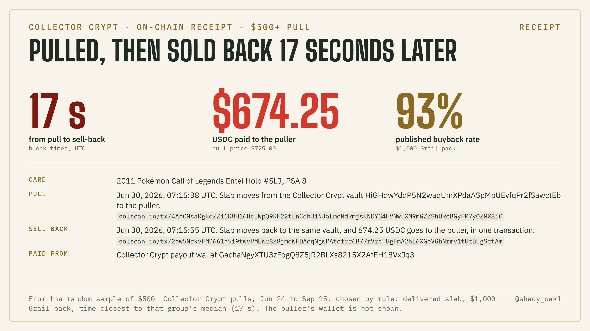

*Receipt (c). One $500+ Collector Crypt sell-back from the on-chain sample; the puller's wallet is not shown.*

**(d) Courtyard: 1997 Pokémon Fossil Articuno Holo #144, PSA 10**

- **Pulled:** minted to the puller on Aug 20, 2026 at 15:12:40 UTC.
- **Sold back:** 50 seconds later, transferred to Courtyard's buyback wallet 0x66dbff2ce099d19b4e8c5dc8b254ec7aeaf5e642.
- **Payout:** the same transaction paid the puller 1,195.82 USDC: 84.6% of the $1,413.50 pull price.
- **Transactions:** [mint](https://polygonscan.com/tx/0x34ee1b6e7ee15fc2784cd0af542633010c4976f9a26e3ab6b625aae89cbc1406), [sell-back](https://polygonscan.com/tx/0x418e1edc1db4f8d369a6a07d7b2370540f83a6aaafd2630659b1cf6761f523e9).

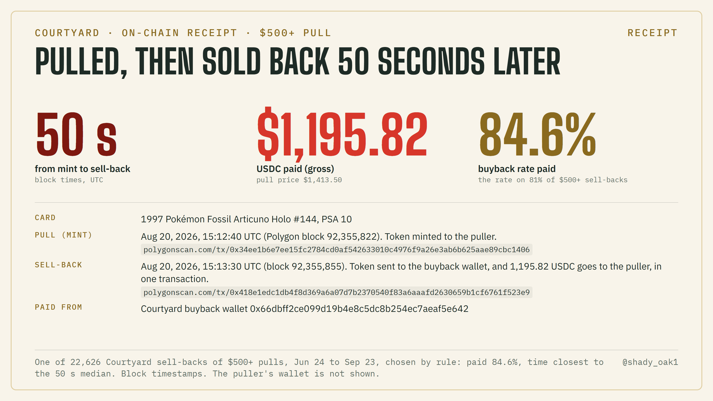

*Receipt (d). One $500+ Courtyard sell-back, Jun 24 to Sep 23; the puller's wallet is not shown.*

## 5. Data

The cleaned dataset behind every figure in this report is in the [data folder](https://github.com/shadyoakcoding/gacha-analysis/tree/master/data).

- **Documentation:** its [README](https://github.com/shadyoakcoding/gacha-analysis/blob/master/data/README.md) has the data dictionary, the windows, the cleaning steps and a one-line recipe for each number above.
- **Format:** all files are CSV (UTF-8, times in UTC).

| File | Rows | One row per |
|---|---|---|
| `pulls_collectorcrypt.csv`, `pulls_phygitals.csv`, `pulls_courtyard.csv` | 100,055; 46,937; 29,704 | pull, Jun 24 to Sep 30: site price, CardLadder value and sale summary at pull time, derived flags |
| `sellback_outcomes_solana.csv` | 8,727 | Collector Crypt or Phygitals pull whose on-chain outcome was read, with Solscan links |
| `courtyard_first_exit.csv` | 28,009 | Courtyard $500+ pull, Jun 24 to Sep 23, with its first exit, blocks and Polygonscan link |
| `courtyard_block_anchors.csv` | 16 | reference block for converting Polygon blocks to time |
| `courtyard_snapshot_oct8.csv` | 7,602 | pull in the Oct 8 six-hour window of Courtyard's live feed |
| `phygitals_100pct_buybacks.csv` | 641 | Black or Diamond Pack "100%" buyback, with ALT and CardLadder values |
| `phygitals_value_checks_oct.csv` | 604 | Phygitals card value check, Oct 3 or Oct 6 |
| `market_drift.csv` | 813 | $500+ slab with 3+ sales in both Jul 1 to 14 and Sep 10 to 23 |
| `charts/`, `tables/` | | the numbers shown in each chart and table |

- **Cleaning:** removed 19 duplicate feed events (12 on Collector Crypt, 7 on Courtyard). Every count in this report and its charts is taken from the cleaned files.
- **License:** our data is CC BY 4.0. CardLadder and ALT values are their owners' estimates, included so the figures can be checked.

## 6. Method and limits

**Data**

- The figures come from public live pull feeds the sites publish, CardLadder values and sales, and public blockchain records.
- Each pull in the dataset carries the site's price, the slab's grading cert number (used to match re-pulls), and CardLadder's value and sales for that cert at pull time.
- The dataset covers:
  - Courtyard $500+ (Pokémon, One Piece; PSA, BGS)
  - Collector Crypt $300+ (Pokémon; PSA)
  - Phygitals $100 to $10,000 (Pokémon; PSA, BGS, CGC)
- Cross-site comparisons use $500+ pulls.
- Coverage begins Jun 24 on Courtyard and Jun 26 on the other two.
- The dataset is published in data/ (section 5).

**Windows**

| Figure | Window |
|---|---|
| Sell-backs | Courtyard pulls Jun 24 to Sep 23 (read Oct 1); Collector Crypt and Phygitals Jun 24 to Sep 15 (read Oct 8) |
| Pulled again | Pulls Jun 24 to Sep 15, re-pulls through Sep 30 |
| Pulls per slab and priced above CardLadder | Jun 24 to Sep 30 |
| Forward test | Pulls Jun 24 to Sep 23, sales in the next 7 days |
| Market drift | Jul 1 to 14 against Sep 10 to 23 |
| Phygitals checks | Oct 3 to 6 |

**Courtyard on-chain**

- **Pulls:** each Courtyard pull appears on Polygon as a token minted to the puller.
- **First exit:** we classified each pulled token's first exit as a transfer to the buyback wallet 0x66dbff2ce099d19b4e8c5dc8b254ec7aeaf5e642 or to the redemption wallet 0x64ecc7f2753df33e21f7c4211ea2b68b608bf8f9. Tokens with neither were counted as still held.
- **Timing:** block numbers were converted to clock time by interpolation between weekly reference blocks (±2 s). Time to sell-back runs from mint block to buyback block.
- **Check:** 400 of 400 random cases matched Courtyard's own transaction history.

**Collector Crypt and Phygitals on-chain**

- **Sample:** we drew a fixed-seed random sample in each tier, then read all 6,927 Phygitals $500+ pulls. The 1,000-pull sample (92.3% ±2.9) matched it pull for pull.
- **Leaving the house:** for each pull we found the Solana transaction, within minutes of the feed time, in which the card left the house (a Collector Crypt vault wallet, or the Phygitals wallet 62Q9eeDY3eM8A5CnprBGYMPShdBjAzdpBdr71QHsS8dS).
- **Outcome:** the next change of holder, one of:
  - sold back (USDC paid by GachaNgyXTU3zFogQ8Z5jR2BLXs8215X2AtEH18VxJq3 or by 62Q9ee);
  - redeemed or shipped (Phygitals: sent to 6VhFyXwkgXmUdy2zNJUSBg5uDat9GTXyPjcCrY8n9DbA; Collector Crypt: the card's token burned, with a shipment memo);
  - moved or sold to another user;
  - or still held.
- **Sell-backs before delivery:** Collector Crypt pulls with no card transfer were matched, on the puller's own history, to a payout of exactly the pull price times the pack rate.
- **Timing:** the gap between the two block times.
- **Checks:** 40 of 40 sampled results matched when each pull and outcome transaction was re-read and decoded independently. 99.4% of sampled pulls whose slab appeared in a later pull in the dataset had first returned to the house. None were left unresolved.

**Limits**

- Re-pulls not in the dataset are not counted, so recycling figures are minimums.
- CardLadder and ALT values are estimates.
- Thin Phygitals sales inflate its "above every recent sale" share (section 3).
- Pulls of the same card are correlated, so the simple-random-sampling margins are approximate.
- The Courtyard snapshot is a single 6-hour window, and the Oct 3 to 6 Phygitals checks are point-in-time.

## 7. Disclosure and attribution

**Disclosure:** the author trades on these platforms with their own tools.

**Attribution:** @shady_oak1, https://x.com/shady_oak1/status/2106006294721429869. Text, charts and data: CC BY 4.0, except the CardLadder and ALT values, which remain their owners' estimates. Site names, logos and page screenshots belong to their owners and are shown for identification.

**Cite as:** @shady_oak1, "Pulled, sold back, repackaged: three crypto card gacha sites, June to September 2026", https://github.com/shadyoakcoding/gacha-analysis, October 2026.
